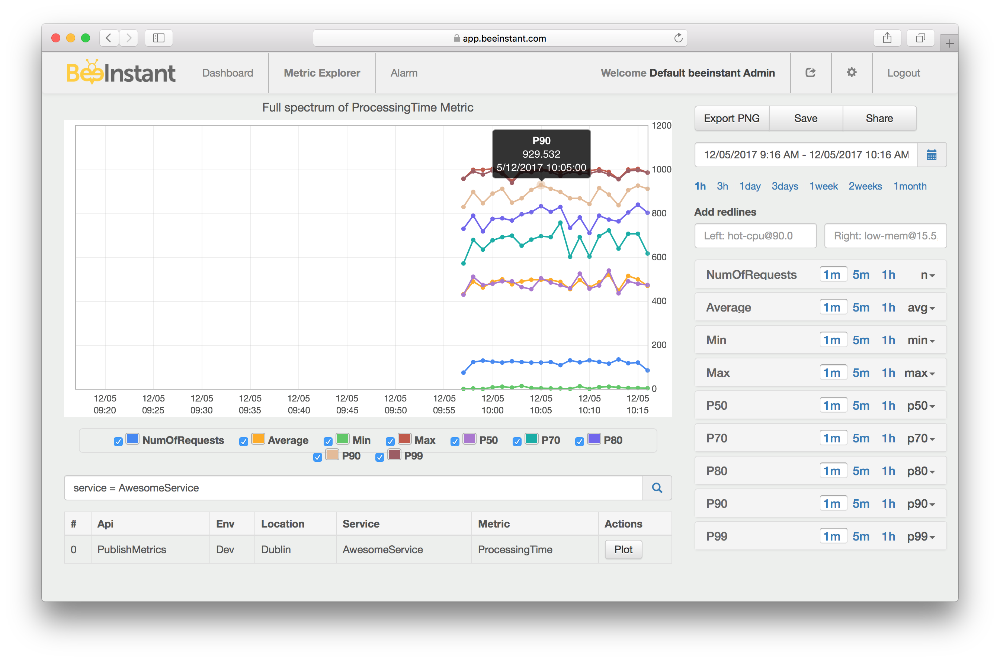

# BeeInstant Go SDK
BeeInstant Go SDK empowers engineers to capture software **performance metrics** and **business metrics** directly from Go code. BeeInstant provides **multi-dimensional metrics** which can be aggregated with **full-spectrum of statistics** not only at host level, but also **at service level**. For example, engineers can put SLA on percentile 99th of Latency metric at service level across thousands of hosts/servers/containers. 

## Installation
```
go get -v github.com/beeinstant-dev/beeinstant-go-sdk
```

**Signup Free** to get credentials to publish advanced custom metrics: [https://beeinstant.com/](https://beeinstant.com/)

## Sample Usage

**Import**
```go
import (
    beeinstant "github.com/beeinstant-dev/beeinstant-go-sdk"
)
```

**Initialize MetricLogger**
```go
beeinstant.InitMetricLogger("MyServiceName",
        "MyEnvironment",
        "PublicKey",
        "SecretKey",
        "Endpoint",
        10) // flush once every 10 seconds
```

**Counter**
```go
beeinstant.GetMetricLogger().IncCounter("MyCounter", 1)
```

**Timer**
```go
startTime := time.Now().UnixNano()
//
// processing works here
//
beeinstant.GetMetricLogger().Record("MyProcessingTime",
    float64((time.Now().UnixNano()-startTime)/1000000),
    beeinstant.MILLI_SECOND)
```

**Arbitrary Metrics with Units**
```go
beeinstant.GetMetricLogger().Record("MyPayload", 100, beeinstant.BYTE)
```

**Dimensions**

Add dimensions to bring more context to metrics.
```go
beeinstant.GetMetricLogger().
    ExtendDimensions("api=PublishMetrics,location=Dublin").
    IncCounter("MyCounter", 1)
```

Multiple metrics per group of dimensions.
```go
metrics := beeinstant.GetMetricLogger().
    ExtendDimensions("api=PublishMetrics,location=Dublin")
    
metrics.IncCounter("MyCounter", 1)
metrics.Record("MyTimer", 100, beeinstant.MILLI_SECOND)
```

## Example
Publish a `ProcessingTime` metric. Only one single multi-dimensional metric brings engineers the full-spectrum of statistics, like max processing time, min processing time, average and series of percentiles 50th 70th 80th 90th 99th, all aggregated at service level in real-time from thousands of hosts/severs/containers. Engineers can spot patterns, detect outliers and put SLAs with this rich set of statistics at service level.



**The sample code**

To follow this example, please sign up at beeinstant.com. It's completely free. You will need `PUBLIC_KEY`, `SECRET_KEY` and `END_POINT` to publish metrics.

```go
package main

import (
    "time"
    beeinstant "github.com/beeinstant-dev/beeinstant-go-sdk"
    "math/rand"
    "fmt"
)

func main() {

    beeinstant.InitMetricLogger("AwesomeService",
        "Dev",
        "PUBLIC_KEY",
        "SECRET_KEY",
        "END_POINT", 
        10)

    metrics := beeinstant.GetMetricLogger().ExtendDimensions("api=PublishMetrics,location=Dublin")

    for i := 0; i < 100000; i++ {
        t := time.Now().UnixNano()

        // random sleep to simulate processing time
        d := rand.Intn(1000)
        fmt.Println(d)
        time.Sleep(time.Duration(d) * time.Millisecond)

        metrics.Record("ProcessingTime",
            float64((time.Now().UnixNano()-t)/1000000),
            beeinstant.MILLI_SECOND)
    }
}
```

Go to [https://app.beeinstant.com](https://app.beeinstant.com) to explore your metrics, build dashboards and set alarms.